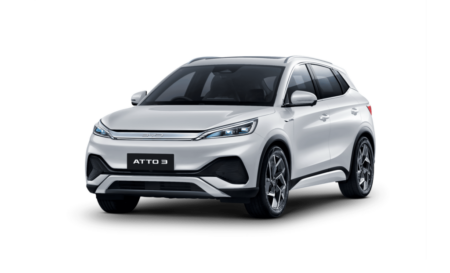
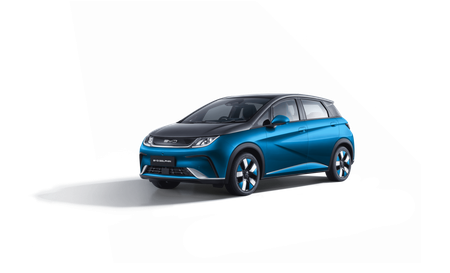
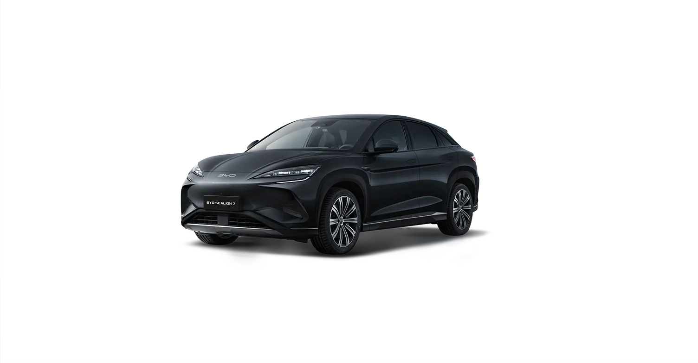
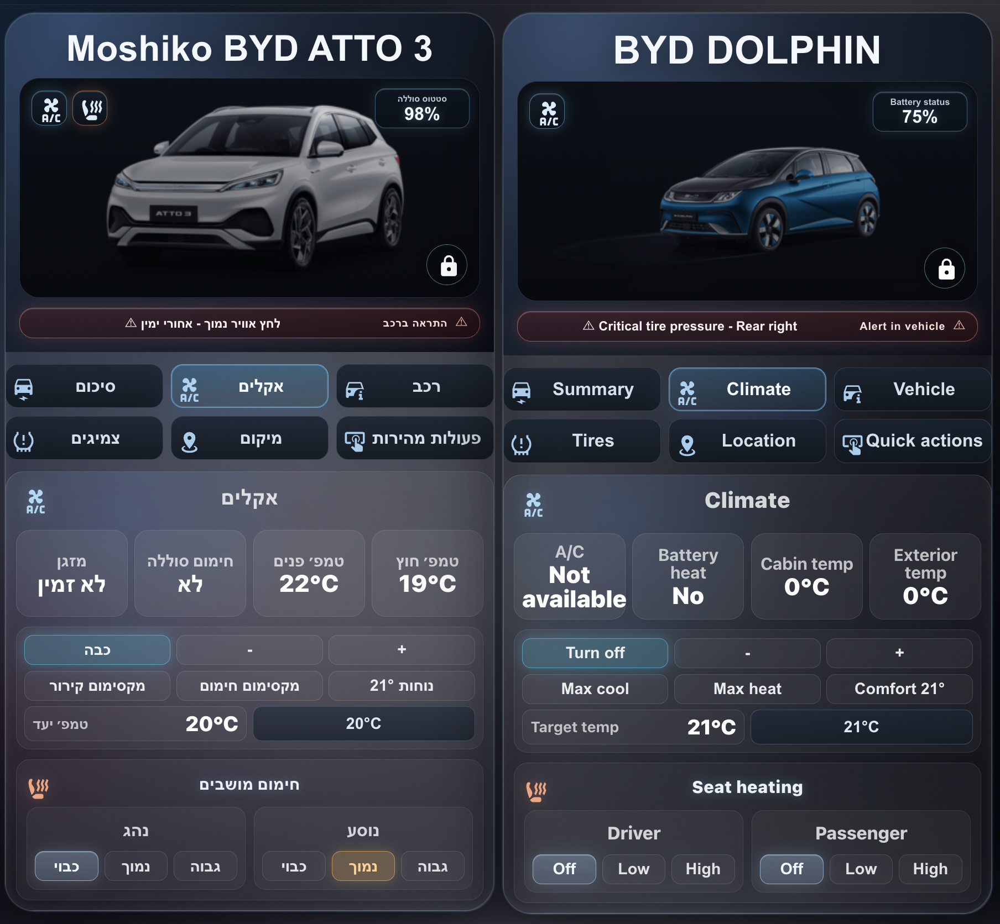
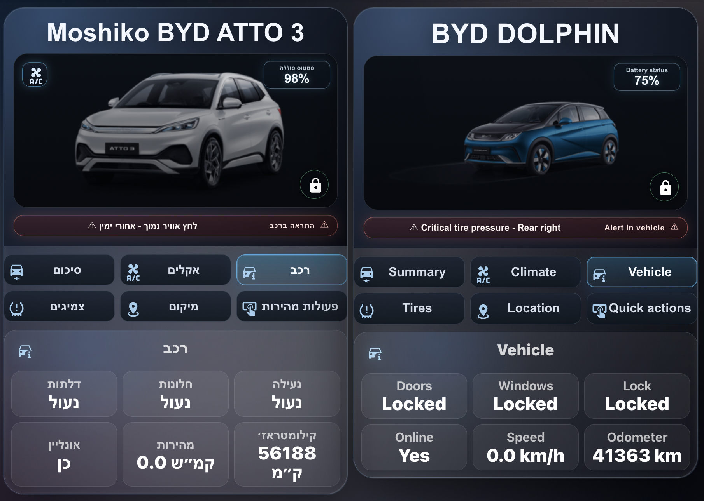
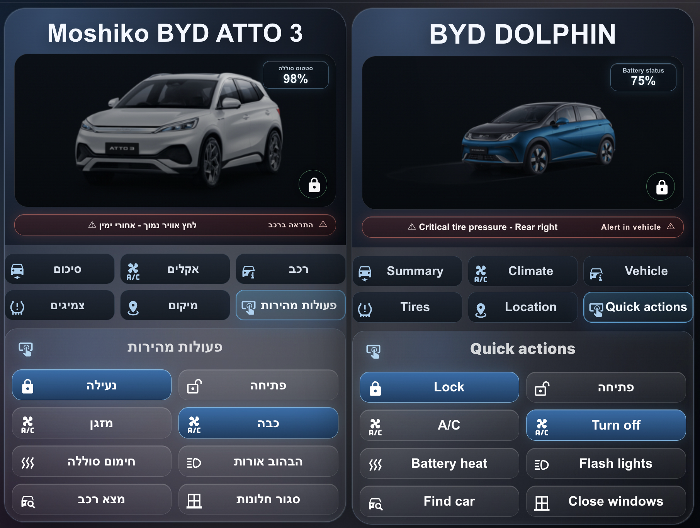
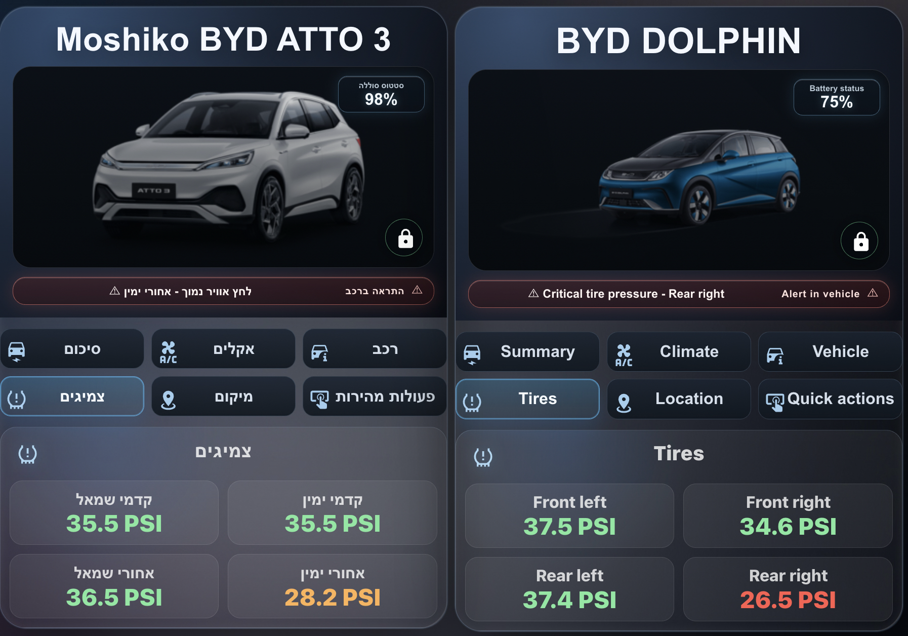
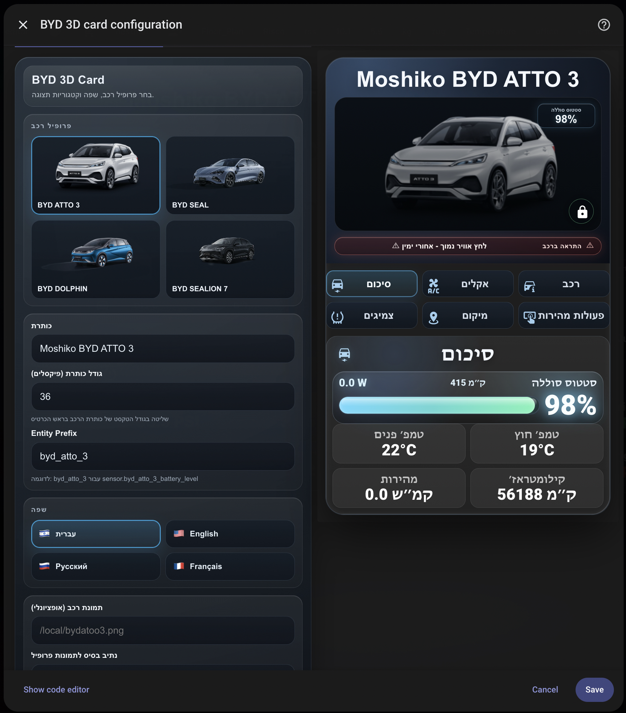
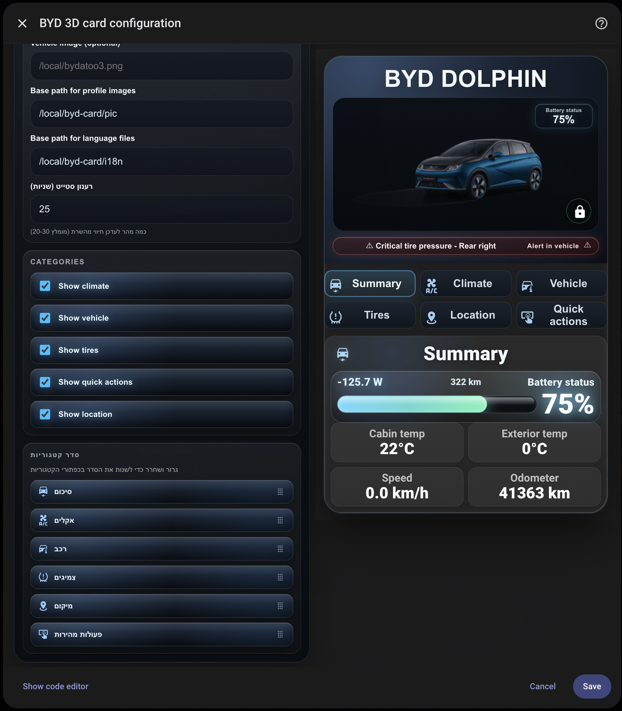

# BYD 3D Card

Advanced Home Assistant Lovelace card for BYD vehicles with a 3D-style UI, multi-language support, vehicle profiles, and category-based controls.

## Important prerequisite (required)

This card **requires** the BYD integration below.  
Without it, the BYD entities do not exist, and the card cannot show data or control the vehicle:

- https://github.com/jkaberg/hass-byd-vehicle

Recommended order:
1. Install `hass-byd-vehicle`.
2. Verify BYD entities are available in Home Assistant.
3. Install and use `BYD 3D Card`.

## Features

- 3D hero layout for vehicle image and battery status
- Vehicle profiles: `ATTO 3`, `SEAL`, `DOLPHIN`, `SEALION 7`
- Auto entity mapping via `entity_prefix`
- Category tabs (radio style):
  - `Summary`
  - `Climate`
  - `Vehicle`
  - `Tires`
  - `Location`
  - `Quick actions`
- Drag & drop category order in UI editor
- Last selected category is remembered after refresh
- Languages: Hebrew, English, Russian, French
- Local profile images from `pic/`

## Install

1. Copy this repository folder to Home Assistant:
   - `/config/www/byd-card/`
2. Add Lovelace resource:
   - URL: `/local/byd-card/byd-3d-card.js`
   - Type: `module`
3. Hard refresh the browser/app.

### If users see "resource not found" or "custom element doesn't exist"

Check these quickly:
1. Resource URL must be exactly:
   - `/local/byd-card/byd-3d-card.js`
2. Resource type must be:
   - `module`
3. File must exist on HA host:
   - `/config/www/byd-card/byd-3d-card.js`
4. If browser/app cache is stale, add a version query:
   - `/local/byd-card/byd-3d-card.js?v=1.0.3`
5. Then hard refresh the browser/app again.

## Basic YAML

```yaml
type: custom:byd-3d-card
vehicle_profile: atto3
title: Moshiko BYD ATTO 3
title_font_size: 35
entity_prefix: byd_atto_3
image_url: ""
image_base_path: /local/byd-card/pic
i18n_base_path: /local/byd-card/i18n
show_tires: true
show_actions: true
show_climate: true
show_vehicle: true
show_location: true
refresh_interval_seconds: 25
language: he
category_order:
  - summary
  - climate
  - vehicle
  - tires
  - location
  - actions
entities: {}

```

## Files

- `byd-3d-card.js` - main custom card file
- `i18n/*.json` - language files
- `pic/` - profile images

## Profile images (in this repo)

- `pic/bydatoo3.png` - BYD ATTO 3 profile image
- `pic/byd_dolphin.png` - BYD DOLPHIN profile image
- `pic/seal.png` - BYD SEAL source profile image
- `pic/sealion.png` - BYD SEALION 7 source profile image
- `pic/byd_seal.png` - resized SEAL variant (450x273)
- `pic/byd_sealion7.png` - resized SEALION 7 variant (450x273)

### Preview

| ATTO 3 | DOLPHIN |
|---|---|
|  |  |

| SEAL | SEALION 7 |
|---|---|
|  |  |

## UI screenshots (with explanation)

### 1) Overview + Summary


What it shows:
- Hero image + battery status badge
- Alert ribbon (single issue example)
- 6 category tabs
- Summary panel with power, range, battery bar and key metrics

### 2) Climate


What it shows:
- Climate metrics (A/C, battery heat, cabin/exterior temperatures)
- Climate controls grid (`on/off`, temp up/down, preset modes)
- Seat heating controls with level buttons
- Active service icons in hero area

### 3) Vehicle


What it shows:
- Vehicle status cards:
  - Doors
  - Windows
  - Lock
  - Online
  - Speed
  - Odometer

### 4) Quick actions


What it shows:
- Quick control buttons:
  - Lock / Unlock
  - A/C On / A/C Off
  - Battery heat
  - Flash lights
  - Find car
  - Close windows
- Active button highlighting and visual feedback

### 5) Tires


What it shows:
- Tire pressure per wheel in PSI
- Color-based status:
  - Green = normal
  - Orange = warning
  - Red = critical

### 6) Editor main view


What it shows:
- Vehicle profile selection with preview images
- Card title + title font size control
- Entity prefix
- Language picker with flags
- Live preview on the right

### 7) Editor categories (Hebrew)


What it shows:
- Image paths and i18n path configuration
- Refresh interval setting
- Category visibility toggles
- Category order drag & drop

### 8) Editor categories (English)


What it shows:
- Full English editor labels
- Same category visibility + ordering workflow
- Live preview in English

## Notes

- `entity_prefix` example:
  - For `sensor.byd_atto_3_battery_level`, use `byd_atto_3`.
- Language files are loaded from:
  - `i18n_base_path/<language>.json`
- If local profile image is missing, the card falls back to built-in SVG.
